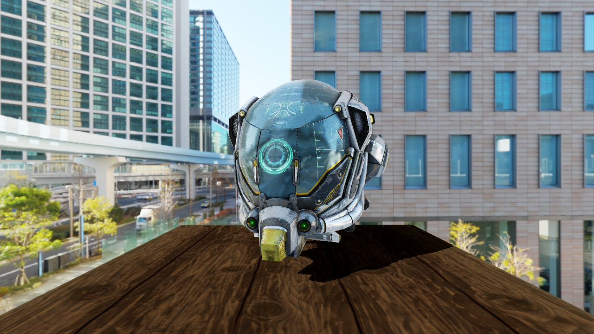

# Rendertoy

Yet another soft renderer for learning

## Prerequistes
* C++ compiler with support for the C++17 standard
* CMake, version 3.10 or higher

## Features

* Shader-based
* Homogeneous clipping(based on SutherlandHodgeman algorithm)
* Back/Front face culling
* Point light and directional light
* Normal mapping
* Cubemap and skybox
* Blinn-Phong shading
* Physically based rendering(metalness workflow)
* Image-based Lighting
* HDR/linear lighting
* tone mappers: ACES
* MSAA(2x/4x)
* Shadow (based on shadow map & PCF)

## Example

**Wireframe**

**Blinn-phong**

**PBR**

**MSAAx4**

**Shadow**

